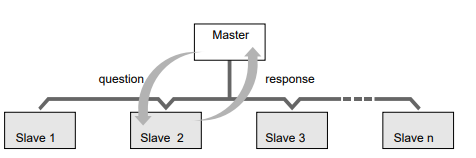
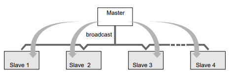

<!--Sturgeon 200 API-->

# Serial Gripper Thruster API
_Revision 1.1_

## 1. Introduction
This document outlines communication requirements for use of SEAMOR Serial Gripper. 

This communication protocol is based on MODBUS over RS-485. MODBUS based debugging tools and resources can be used for testing and validation, but no guarantee is made by SEAMOR for full compatibility with existing MODBUS devices or libraries.
Terminology consistent with MODBUS standards is used throughout this document. Please refer to https://www.modbus.org/specs.php for more details.

### 1.1 Node Types

#### 1.1.1 Client

The client is the network device that initiates all communication, typically a processor that will also communicate on other networks. 

!!! Warning  
	Only one Client is allowed per network

<!-- blank line between Warning and note-->

!!! NOTE 
	Client is referred to as Master in Legacy MODBUS documentation

#### 1.1.1 Server

A Server is a network device that responds to requests from a Client. Typically end node devices on the network.

!!! Warning 
	Maximum 63 Servers on a network

<!-- blank line between Warning and note-->

!!! NOTE 
	Server is referred to as Slave in Legacy MODBUS documentation. Slave ID is used in this document to identify Servers. 

## 2. Network Requirements	

### 2.1 Communication Port settings

|  Setting        | Value       |
|-----------------|-------------|
| Baud Rate       |   115200	|
| Start Bit       | 1			|
| Stop Bit        | 1        	|
| Parity Bit      | None     	|

### 2.2  Message Gap

Minimum 20 ms required between messages on the network (received or transmitted).

### 2.3 Timeout

Any controllable action (eg. gripper rotation) will be maintained for a maximum of 1 second after successful message receipt. After timeout expiry the device will stop actions until the next valid command is recieved.

## 3. Message Types

### 3.1 Request/ Response 

#### 3.1.1 Frame Layouts
##### 3.1.1.1 Client - Read Request
|Byte #| 1        | 2           | 3                    | 4                    | 5               | 6               | 7       | 8       |
|------|----------|-------------|----------------------|----------------------|-----------------|-----------------|---------|---------|
|Name  | Slave ID | Function ID | Register Address MSB | Register Address LSB | # Registers MSB | # Registers LSB | CRC LSB | CRC MSB |

##### 3.1.1.2 Server - Read Reponse
|Byte #| 1        | 2           | 3            | 4             | 5             | ...| _n-1_   |  __n__  |
|------|----------|-------------|--------------|---------------|---------------|----|---------|---------|
|Name  | Slave ID | Function ID | # Bytes Read | Data MSB _x_  | Data LSB _x_  | ...| CRC LSB | CRC MSB |

##### 3.1.1.3 Client - Write Request
|Byte #| 1        | 2           | 3                    | 4                    | 5        | 6        | 7       | 8       |
|------|----------|-------------|----------------------|----------------------|----------|----------|---------|---------|
|Name  | Slave ID | Function ID | Register Address MSB | Register Address LSB | Data MSB | Data LSB | CRC LSB | CRC MSB |

##### 3.1.1.4 Server - Write Response
|Byte #| 1        | 2           | 3                     | 4                    | 5        | 6        | 7       | 8       |
|------|----------|-------------|-----------------------|----------------------|----------|----------|---------|---------|
|Name  | Slave ID | Function ID |  Register Address MSB | Register Address LSB | Data MSB | Data LSB | CRC LSB | CRC MSB |

#### 3.1.2 Byte Definitions

#### 3.1.2.1 Slave ID
The unique 8-bit identifier for individual Servers. The configured device identifier valid in range of 0x01-0x3F (0x40-0xFE invalid, 0xFF indicates unconfigured).

Slave ID 0x00 is reserved to indicate Broadcast Message (See Client Broadcast Definition). 

!!! Warning 
	The default Slave ID is 0xFF before receiving a Write Request setting the Slave ID. 

#### 3.1.2.2 Function ID
The unique 8-bit identifier to represent operation requested of the Server. 

| Description              | ID code |
|--------------------------|---------|
| Read Read/Write Register | 0x03    |
| Read Read-only Register  | 0x04    |
| Write Read/Write Register| 0x06    |

!!! NOTE 
	Other MODBUS Function IDs are not supported.

#### 3.1.2.3 Register Address
The 16-bit register address for target operation, offset from database start register. Split into Most Significant Byte (MSB) and Least Significant Byte (LSB).

#### 3.1.2.4 Number Of Registers 
The 16-bit value representing the number of registers in read request operation. Split into Most Significant Byte (MSB) and Least Significant Byte (LSB).

#### 3.1.2.5 Number of Bytes Read
The 8-bit value representing number of bytes returned.

!!! NOTE 
	Each register contains 2 bytes

#### 3.1.2.6 Data
The 16-bit contents read from, or to be writtten into, target register. Split into Most Significant Byte (MSB) and Least Significant Byte (LSB).

!!! NOTE 
	Read requests of greater than 1 register start at requested address

#### 3.1.2.7 CRC
The 16-bit Cyclic Redundancy Check (CRC) value of frame. Split into Most Significant Byte (MSB) and Least Significant Byte (LSB).

Standard MODBUS CRC-16-ANSI (CRC-16-IBM) is used with algebraic polynomial 0xA001 (reverse of 0x8005). 

!!! Warning 
	Sent in standard MODBUS little-endian format (CRC LSB first, CRC MSB second)

### 3.2 Client Broadcast

Broadcast Messaging allows for simultaneous communication with all Servers on the network.

!!! NOTE 
	Servers do not respond to Broadcast Messages

<!--blank space to ensure break between note and Warning-->

!!! Warning 
	The maximum Broadcast Message length is 24 bytes

#### 3.2.1 Frame Layout

| Byte \# |     1     |     2       |         3             |           4           |       5      |         6-22        |     n-1   |     n   |
|---------|-----------|-------------|-----------------------|-----------------------|--------------|---------------------|-----------|---------|
| Name    | Slave  ID | Function ID | Register Address MSB  | Register Address LSB  | Broadcast ID | Data Payload        | CRC LSB   | CRC MSB |

#### 3.2.2 Byte Definitions

##### 3.2.2.1 Slave ID
The unique 8-bit identifier for individual Servers, configured device identifier valid in range of 0x01-0x3F (0x40-0xFE invalid, 0xFF indicates unconfigured).

!!! NOTE 
     Byte 1 in the frame is Slave ID 0x00 indicating a Broadcast Message, all other Slave ID used in frame refer to specific Server

##### 3.2.2.2 Function ID 
The unique 8-bit identifier to represent operation requested of the Server. 

!!! Warning 
	Only supported Broadcast Message function code is Write Read/Write Register: 0x06

##### 3.2.2.3 Register Address
The 16-bit register address for target operation, offset from the database start register. Split into Most Significant Byte (MSB) and Least Significant Byte (LSB).

##### 3.2.2.4 Broadcast ID
The unique 8-bit identifier to indicate frame structure.

##### 3.2.2.5 Data Payload 
The number of bytes and function specific to Broadcast ID (See Broadcast Payload Structure Definition)

##### 3.2.2.6 CRC
The 16-bit Cyclic Redundancy Check (CRC) value of frame. Split into Most Significant Byte (MSB) and Least Significant Byte (LSB). 

Standard MODBUS CRC-16-ANSI (CRC-16-IBM) is used with algebraic polynomial 0xA001 (reverse of 0x8005). 

!!! Warning 
	Sent in standard MODBUS little-endian format (CRC LSB first, CRC MSB second)

#### 3.2.3 Broadcast Payload Structure

##### 3.2.3.1 Broadcast ID 0x03

Used to broadcast open/close state and rotate state to multiple Servers. Valid for 1-8 Servers simultaneously (maximum data payload 3-17 bytes). 

!!! NOTE 
     Variable frame lengths are supported

| 	Data Payload Byte \#    |         1              |         2 	   |           3            |         4 	   |           5            |...|         16 	   |           17            |
|---------------------------|------------------------|-----------------|------------------------|------------------|------------------------|---|------------------|------------------------|
| Name                      |  Payload # Bytes     | Payload Byte 1A |  Payload Byte 1B       |  Payload Byte 2A |  Payload Byte 2B       |...|  Payload Byte 8A |  Payload Byte 8B       |

###### 3.2.3.1.1 Payload Number of Bytes

Number of payload bytes in the frame.

###### 3.2.3.1.2 Payload Byte xA

|Bits       | 0-1                                                                                | 2-7                    |
|-----------|------------------------------------------------------------------------------------|------------------------|
|Function   |Open/Close Motor State                                                              |Slave ID                |
|Description|<pre> 0b00 = Idle   0b01 = Open   0b10 = Close   0b11 = invalid  </pre> | See Slave ID definition|

#### 3.2.3.1.3 Payload Byte xB

|Bits       | 0-1                                                                            | 2-7                    |
|-----------|--------------------------------------------------------------------------------|------------------------|
|Function   |Open/Close Motor State                                                          |Unused                  |
|Description|<pre> 0b00 = Idle   0b01 = CW   0b10 = CCW   0b11 = invalid  </pre> |                        |

### 3.3 Exception Responses

Server Reponse to Client Requests

| Byte \# |     1     |     2                               |   3            |   4     |     5   |
|---------|-----------|-------------------------------------|----------------|---------|---------|
|Name     | Slave ID  | Function ID \(Function ID \| 0x80\) | Exception Code | CRC LSB | CRC MSB |

!!! NOTE 
     The function codes for exception frames are Boolean OR with 0x80 and standard function codes

## 4 Register Addresses

### 4.1 Read/Write Registers

| Address  	   | Offset     | Byte     |     Bit Name              |   Description                                                                                                                                            |
|--------------|------------|----------|---------------------------|--------------------------------------------------------------------------------------------------------------------------------------------------------|
| 40001        | 0          | LSB      | Slave ID                  | Unique Server Identifier                                                                                                                                             |
| 40001        | 0          | MSB      | N/A                       | -                                                                                                                                                      |
| 40002        | 1          | LSB      | N/A                       |                                                                                   |
| 40002        | 1          | MSB      | N/A                       | -                                                                                                                                                      |
| 40003        | 2          | LSB      | N/A                       | -                                                                                                                                                      |
| 40003        | 2          | MSB      | N/A                       | -                                                                                                                                                      |
| 40004        | 3          | LSB      | Rotate Motor State        | 0 = Idle,  1 = CW, 2 = CCW                                                                                                                                                                                                             |
| 40004        | 3          | MSB      | Open/Close Motor State    | 0 = Idle,  1 = Open, 2 = Close                                                                                                                               |
| 40005        | 4          | LSB      | N/A                       | -                                                                                                                                                      |
| 40005        | 4          | MSB      | N/A                       | -                                                                                                                                                      |

!!! NOTE 
     The propellor rotation direction reference from nozzle end of thruster

<i>Clockwise Rotation</i>

### 4.2 Read-Only Register Addresses

| Address      | Offset     | Byte     | Name                      |     Bit Resolution |     Offset |     Description                            |
|--------------|------------|----------|---------------------------|--------------------|------------|--------------------------------------------|
| 30001        | 0          | LSB      | N/A                       | -                  | -          | -                                          |
| 30001        | 0          | MSB      | Peripheral ID             | -                  | -          | Unique Identifier for Device Type          |
| 30002        | 1          | LSB      | N/A                       | -                  | -          | -                                          |
| 30002        | 1          | MSB      | N/A                       | -                  | -          | -                                          |
| 30003        | 2          | LSB      | Rotate Motor Current      | 0\.01 A/bit        | 0          | Measured Rotate Motor Current              |
| 30003        | 2          | MSB      | Open/Close Motor Current  | 0\.01 A/bit        | 0          | Measured Open/Close Current                |
| 30004        | 3          | LSB      | Voltage                   | 0\.25 V/bit        | 0          | Measured Input Voltage                     |
| 30004        | 3          | MSB      | Internal Temperature      | 1 °C/bit           | \-50 °C    | Measured Board Temperature                 |
| 30005        | 4          | LSB      | N/A                       | -                  | -          | -                                          |
| 30005        | 4          | MSB      | N/A                       | -                  | -          | -                                          |

### 4.3 Exception Response Codes

A unique 8-bit identifier used in response from Server to Client indicating success or error details.

| Title		           | Exception Code     | Description                                                                                   |
|----------------------|--------------------|-----------------------------------------------------------------------------------------------|
| Illegal Function     | 0x01               | The Server does not support requested function                                                |
| Illegal Data Address | 0x02               | The data address not valid for requested operation                                            |
| Illegal Data Value   | 0x03               | The data value not valid for requested operation                                              |
| Server Failure       | 0x04               | An unrecoverable failure occured while performing requested operation                         |
| ACK                  | 0x05               | The Server has accepted the request, some duration of time should be expected before complete |
| Server Busy          | 0x06               | The Server is currently busy processing a prior request                                       |
| NACK                 | 0x07               | The Server cannot perform the requested operation                                             |

## 5 Example Message Exchanges

### 5.1 Read Request - Example 1

Read Request for Voltage and Temperature from Slave ID 16:
   
| Slave ID | Function ID | Register Address MSB | Register Address LSB | # Registers MSB | # Registers LSB | CRC LSB | CRC MSB |
|----------|-------------|----------------------|----------------------|-----------------|-----------------|---------|---------|
| 0x10     | 0x04        | 0x00                 | 0x03                 | 0x00            | 0x01            | 0xC2    | 0x8B    |

Response from Server to the Client:

| Slave ID  | Function ID  | # Bytes Read |   Data MSB    |   Data LSB    | CRC LSB | CRC MSB |
|-----------|--------------|--------------|---------------|---------------|---------|---------|
| 0x10      | 0x04         | 0x02         | 0x49          | 0x40          | 0x73    | 0x53    |

Slave ID 16 responds temperature 23°C and voltage 16V.

### 5.2	Read Request - Example 2

Read Request for both motor states from Slave ID 16:

| Slave ID | Function ID | Register Address MSB | Register Address LSB | # Registers MSB | # Registers LSB | CRC LSB | CRC MSB |
|----------|-------------|----------------------|----------------------|-----------------|-----------------|---------|---------|
| 0x10     | 0x03        | 0x00                 | 0x03                 | 0x00            | 0x01            | 0x77    | 0x4B    |

Response from Server to the Client:

| Slave ID  | Function ID  | # Bytes Read |   Data MSB    |   Data LSB    | CRC LSB | CRC MSB  |
|-----------|--------------|--------------|---------------|---------------|---------|----------|
| 0x10      | 0x03         | 0x02         | 0x02          | 0x00          | 0x45    | 0x27     |

Slave ID 16 responds Open/Close Motor State is close and Rotate State is idle.

<!--
### 5.3	Read Request - Example 3

Read multiple registers, Slave ID and Thruster orientation from Slave ID 16:

| Slave ID | Function ID | Register Address MSB | Register Address LSB | # Registers MSB | # Registers LSB | CRC LSB | CRC MSB |
|----------|-------------|----------------------|----------------------|-----------------|-----------------|---------|---------|
| 0x10     | 0x03        | 0x00                 | 0x00                 | 0x00            | 0x02            | 0xC7    | 0x4A    |

Response from Server to the Client:

| Slave ID | Function ID | # Bytes Read      |   Data MSB 1    |   Data LSB  1   |   Data MSB 2    |   Data LSB  2   | CRC LSB | CRC MSB |
|----------|-------------|-------------------|-----------------|-----------------|-----------------|-----------------|---------|---------|
| 0x10     | 0x03        | 0x04              | 0x00            | 0x10            | 0x00            | 0x01            | 0x3B    | 0x37    |

Slave ID 16 responds with its configured Slave ID 16 and orientation 0x01: Right hand propeller.

-->
 
### 5.4 Write Request  - Example 1

Write request to Slave ID 220 for Rotate Motor State to Idle and Open/Close Motor State to Close:

| Slave ID | Function ID | Register Address MSB | Register Address LSB | Data MSB | Data LSB | CRC LSB | CRC MSB |
|----------|-------------|----------------------|----------------------|----------|----------|---------|---------|
| 0xDC     | 0x06        | 0x00                 | 0x03                 | 0x02     | 0x00     | 0x6A    | 0x27    |

Response from Server to the Client:

| Slave ID | Function ID | Register Address MSB | Register Address LSB | Data MSB | Data LSB | CRC LSB | CRC MSB |
|----------|-------------|----------------------|----------------------|----------|----------|---------|---------|
| 0xDC     | 0x06        | 0x00                 | 0x03                 | 0x02     | 0x00     | 0x6A    | 0x27    |

Slave ID 220 responds Rotate Motor State in Idle and Open/Close Motor State in Close.

### 5.5 Write Request  - Example 2 

Write request to unconfigured Server (Slave ID 0xFF) with target Slave ID 2:

| Slave ID | Function ID | Register Address MSB | Register Address LSB | Data MSB | Data LSB | CRC LSB | CRC MSB |
|----------|-------------|----------------------|----------------------|----------|----------|---------|---------|
| 0xFF     | 0x06        | 0x00                 | 0x00                 | 0x00     | 0x02     | 0x1D    | 0xD5    |

Response from Server to the Client:

| Slave ID | Function ID | Register Address MSB | Register Address LSB | Data MSB | Data LSB | CRC LSB | CRC MSB |
|----------|-------------|----------------------|----------------------|----------|----------|---------|---------|
| 0x02     | 0x06        | 0x00                 | 0x00                 | 0x00     | 0x02     | 0x08    | 0x38    |

!!! Warning 
	Server responds to write request for target Slave ID using updated Slave ID

### 5.6 Broadcast - Example 1

Write Rotate Motor State and Open/Close Motor State to following Servers:

| Slave  ID | Rotate State | Open/Close State |
|-----------|--------------|------------------|
|     1     |     Idle     |       Open       |
|     2     |     CCW      |       Close      |
|     3     |     CW       |       Idle       |
|     4     |     Idle     |       Close      |
|     5     |     CW       |       Open       |
|     6     |     CCW      |       Idle       |

Example Payload 1A:

|Bits       | 0-1                    | 2-7     |
|-----------|------------------------|---------|
|Description|Open/Close Motor State  |Slave ID |
|Value      |0b01                    | 0b01    |

Resulting in 0b00000101 (0x05)

Broadcast Message:

| Slave  ID | Function ID | Register Address MSB | Register Address LSB | Broadcast ID | Payload # Bytes   | Payload 1A | Payload 1B | Payload 2A| Payload 2B | Payload 3A| Payload 3B | Payload 4A| Payload 4B | Payload 5A| Payload 5B | Payload 6A| Payload 6B | CRC LSB   | CRC MSB |
|-----------|-------------|----------------------|----------------------|--------------|-------------------|------------|------------|-----------|------------|-----------|------------|-----------|------------|-----------|------------|-----------|------------|-----------|---------|
| 0x00      |   0x06      |     0x00             |     0x03             |   0x03       |      0x0C         |    0x05    |    0x00    |    0x0A   |    0x02    |    0x0C   |    0x01    |    0x12   |    0x00    |    0x15   |    0x01    |    0x18   |    0x02    |    0x3B   |   0x2D  |

 No network response from Servers.

### 5.7 Exception Response - Example 1

The Client is requesting to read register address 0x00A0 of the Server with Slave ID 220.

!!! Warning 
	Register address 0x00A0 is invalid

| Slave ID | Function ID | Register Address MSB | Register Address LSB  | # Registers MSB | # Registers LSB | CRC LSB | CRC MSB |
|----------|-------------|----------------------|-----------------------|-----------------|-----------------|---------|---------|
| 0xDC     | 0x03        | 0x00                 | 0xA0                  | 0x00            | 0x03            | 0x17    | 0x64    |

Response from Server to the Client

| Slave ID | Function ID \(Function ID \| 0x80\) | Exception Code | CRC LSB | CRC MSB |
|----------|-------------------------------------|----------------|---------|---------|
| 0xDC     |                0x83                 | 0x02           | 0x50    | 0xCB    |

!!! NOTE 
     This assumes the message is recieved and passes CRC validation. The exception response indicates the data address range is invalid.

    
    &copy; 2025 SEAMOR Marine Ltd.

